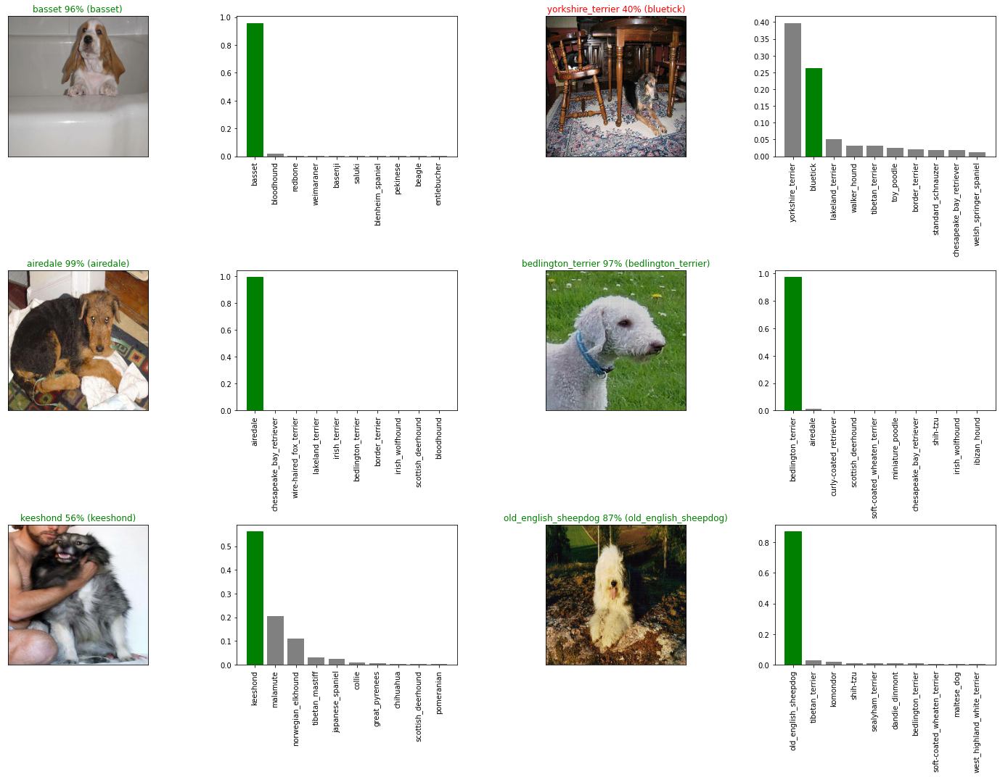

# Dog-Classification-Deeplearning-End-to-End
Dog Breed Classification Competition on Kaggle using Tensorflow 2.0 and Tensorflow Hub - Deep Learning / Machine Learning



## Run  
Run directly using Google Colab - https://colab.research.google.com/github/varunss94/Dog-Classification-Deeplearning-End-to-End/blob/main/dog_vision.ipynb 

### Installation Requirments

1) This project requires **Python** and the following Python libraries installed:

- [NumPy](http://www.numpy.org/)
- [Pandas](http://pandas.pydata.org/)
- [matplotlib](http://matplotlib.org/)
- [scikit-learn](http://scikit-learn.org/stable/)

You will also need to have software installed to run and execute a [Jupyter Notebook](http://ipython.org/notebook.html)

If you do not have Python installed yet, it is highly recommended that you install the [Anaconda](http://continuum.io/downloads) distribution of Python, which already has the above packages and more included.
  
RUN : 
```bash
jupyter notebook dog_vision.ipynb
```

This will open the Jupyter Notebook software and project file in your browser.

### Data

The data is from the Kaggle's dog breed identification competition.

https://www.kaggle.com/c/dog-breed-identification/data

### Evaluation
The evluation is a file with prediction for each dog breed of each test image.

https://www.kaggle.com/c/dog-breed-identification/overview/evaluation

### Features
Some information of the data:

- We are dealing with ustructured data - images so it is best to used Deep Learning/Transfer Learning
- There are 120 breeds of dogs (120 different classes)
- There are around 10,000+ images in the training set
- There are around 10,000+ images in the test set


